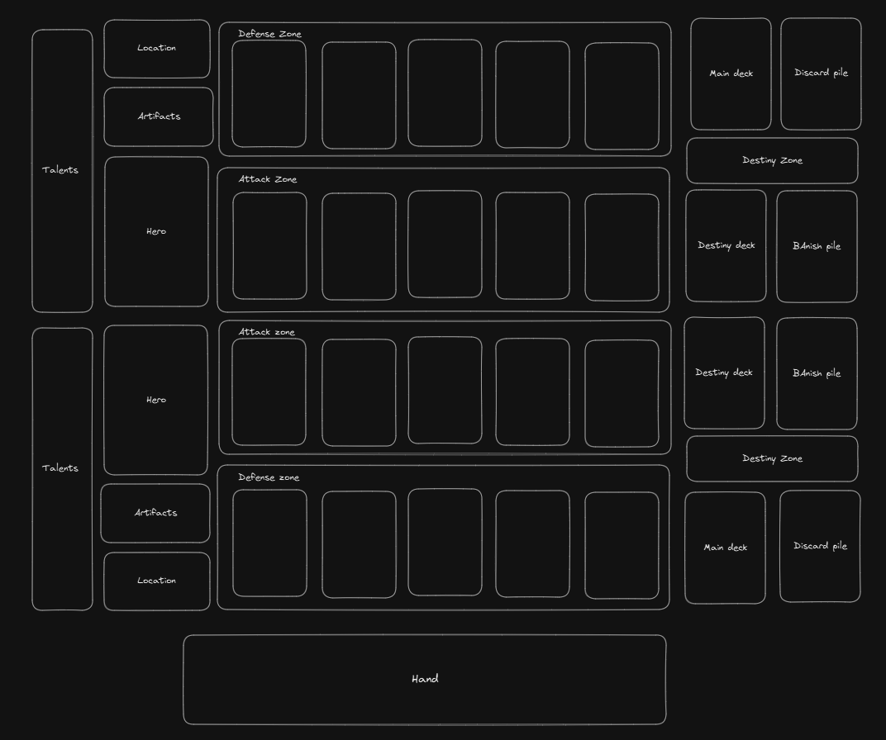

# Clashing Destiny

## What is this game about ?

Clashing Destiny is a PVP digital Collectible Card Game, where 2 players control a hero, summon creatures, cast spells and equip artifacts to defeat the opponent hero.

Main inspirations: Grand Archive TCG, Carte Online

## Start of the game

Both players prepare 2 decks: a **Main deck** and a **Destiny deck**. 

When the game starts they draw 6 cards from their main deck.

## Win Condition

The goal of the game is to reduce the Health of the opponent's **Hero** to zero.

## Board

The board is comprised of 2 symmetrical board sides, one for each player.

The content of a board side is as follows:

### Talent Zone

This zone contains 4 slots to display the **Talent cards** the player has unlocked during the game

### Hero Zone
 
This zone contains:
- The player's hero: **Hero cards** are placed on top of each other as the hero levels up
- Artifacts : one slot for each kind of **Artifact card**: Weapon, Armor and Relic
- Location: one slot for the player current **Location card**

### Minion Zone

This zone contains 2 other zone: the Attack zone and the Defense zone. They have 5 slots each where players put the **Minion cards** they summon. That means a player can have a maximum of 10 minions on the board at the same time.

### Deck Zone

This zone contains
- The **Main deck**
- The **Destiny deck**
- The **Discard pile**
- The **Banish pile**
- The Destiny Zone where the player will put cards face down in order to play cards from the **Main deck**.

## Cards

The game has two types of card: **Main deck cards** and **Destiny deck cards**

### Main Deck Cards

Main deck cards are located in the **Main Deck**. In order to be played, a player must put cards from their hand into their **Destiny Zone** face down equal to the card's mana cost. Those cards will return to its owner's hand during their next turn (see the Destiny Phase section).

When a Main deck card leaves the board, it goes into the **Discard pile**.

The main deck can contain between 40 and 60 cards. The same card can be added up to 4 times.

Here are the different types of Main deck cards:

#### Minions

Minions go into the Minion zone's Attack of Defense Zone. They have attack and hp stats. They are able to attack other minions or the enemy hero, block attacks and use abilities

Once a minion has been summoned on one of the slots in the Creature Zone, it cannot move except as a result of another card's effect.

Minions cannot attack the turn they are summoned. They can, however, use abilities or block as they are not exhausted.

Minion damage persists between turns.

##### Positioning clarifications

Positioning plays an important role in Clashing Destinies. Some card effects may targets specific spaces:
- in front: if the minion is in the defense zone, it means the minion on the same slot of that minion's controller attack zone. If the minion is in the attack zone, it means the minion on the attack zone of that card's player's opponent.
- behind: if the minion is in the defense zone, this whiffs. If the minion is in the attack zone, it means the minion on the same slot of that minion's controller defense zone.
- adjacent: This means the spaces in front of, behind, and to the sides of that minion. Diagonals do not count.
- same row: all spaces on the same attack or defense zone
- same column: all spaces on the same positional slot of both players's attack and defense zone

#### Spells

Spells are one time effects. Once resolved, they go directly to the **Discard pile**. 

There are two types of spells: **Cast** and **Burst**. Only Burst spells can be played during an Effect Chain (see the Effect Chain section).

#### Artifacts

Artifacts are attached to your Hero and enhance their performance in battle or give them new abilities. Every Artifact has a **durability** stat, When it reaches 0, the artifact is removed and sent to the **Discard pile**.

there are 3 types of artifacts: Weapons, Armors and Relics. A hero can only have one of each type equiped at the same time. If another one is equiped, the previous one is considered destroyed and is sent to the **Discard pile**

##### Weapons

Weapons have an attack stat. Your hero's attack is increased by that amount while it is equipped. 

Weapons lose 1 durability after your hero attacks.

##### Armor

Armor prevent your hero from taking damage.

Armors lose durability when your hero takes damage, equal to the damage taken.

##### Relic

Relics do not lose durability by default, but they usually have an activated ability that consumes one or more durability.

#### Attacks

Attack cards are a secondary way to attack with your hero. Like spells, they go straight to the discard pile upon use.

Using an Attack card will immediately transition you to the combat phase, with your Hero declaring the attack.

Attacks declared via an Attack card cannot be blocked.

Like any othern normal attack, upon playing the attack card, your hero will be exhausted.

#### Locations

Locations are cards that provide various bonus or effects to your side of the board. Only one Location card can be active on one side of the board. If another one is played, the current one is first sent to the Discard pile.

#### Card Affinity

A card has an **Affinity** associated to it. There are many affinities in the game, such as fire, frost, arcane, shadow, etc...In order for the card to resolve properly, its player needs to have unlocked its corresponding affinity. If they haven't, the card is instead treated as a **Spell** with the text "Draw one card into your destiny zone.".

### Destiny Deck Cards 

Destiny deck cards are located in the **Destiny Deck**. In order to be played, a player must send cards from their **Destiny Zone** to their **Banish pile** at random equal to the card's Destiny Cost.

The destiny deck can contain exactly 12 different cards.

Here are the different types of Destiny Deck Cards :

#### Heroes

Hero are the main cards of this game. If a hero's hp reach 0, they lose the game.

Players start with a level 0 Novice with the **Normal** affinity already in play. However, over the course of the game, players are able to level up their hero up to a level 3.

While the default way of leveling up a hero only happens once per turn (see the Turn Structure section below), card effects may enable a player to trigger additional level ups. They cannot however, level up above level 3, or level up to a hero of the same level. They must have a level 0 hero, then level 1, 2 , 3.

In addition to HP and Attack, Heroes have another stat called Power, that may enhance the effect of some other cards. For example, "Deal 1 + Power damage to an enemy".

Each Hero has a few (usually 3) unlockable **Affinities**. When the Hero is played, its player chooses one of those affinities and is now able to play cards of the same affinity to full effect.

When a hero levels up, its previous hero remains on the board, below the new card. It is considered to be te player's **Hero Lineage**. Most heroes have a lineage requirement; for example, To play a level 3 Warlock, you need to have a Mage in your lineage.

#### Talents

Talents are passive bonuses tha persist throughout the whole game. They may give bonus to minions, add new effect that trigger under specific conditions, or give activated abilities to the Hero. 

Talents are tied to a hero class, this means that, for exemple, to play a Mage talent, you need to have your current Hero to be a Mage, or have a Mage in your lineage.

Talents remain on the board when played, in the Talent Zone. This one had 4 slots, thus a player may only have 4 active talents. If the one is full, they cannot override them with another Talent card.

### Exhaustion

An *exhausted* card cannot attack, block or use an ability. A card becomes exhausted when
- it declares an attacks
- it declares a block
- it uses an ability (note: not all abilities exhaust the card).

A card loses its exhausted status at the start of its player's turn. Losing the exhausted status is referred as *activating*.

## Turn Structure

Each turn has a few phases that always happen in the same order:

### Start Phase

During the Start Phase, all of the turn player's card are activated, then they draw 1 card. Player can not take any action during this phase.

Once they have draw for turn, the turn player moves to the **Destiny Phase**.

### Destiny Phase

During the Destiny phase, the turn player player have the opportunity to play one and only one card from their Destiny Deck (either a Hero or Talent card), by banishing cards at random from their Destiny Zone. They may choose not to play any card.

Once they have done so, all cards in the turn player's Destiny Zone return to their hand.

### Main Phase 

During the Main phase, the turn player can:
- Play cards from their hand
- Declare an attack: this will automatically progress the game to the Combat Phase.
- Use a card ability

### Combat phase

The Combat Phase starts when the turn player declares an attack. To do so, they will select their Hero or one of their minion in the Attack Zone, and select a target, which is any enemy Minion, or the Enemy Hero.

Declaring the attack immediately exausts the attacker.

Once done, and after **On Declare Attack** effects have resolved, control passes to the Opponent who has the opportunity to:
- Declare a blocker by selecting one of their minion in the Defense Zone. This minion will then participate in combat instead of the initial attack target. They may chose not to block the attack.
- Start an **Effect Chain** (see below)

Declaring a blocker immediately exhausts the blocker.

Once the blocker has been declared, and the effect chain resolved, both combat participant deal damage to each other equal to their attack.

After combat has resolved, the game goes back to the Main Phase where the turn player may play other cards and declare other attacks.

### End Phase

During the end Phase, the turn player's opponent may start an effect Chain. Once it is resolve, or if no chain is declared, The turn ends.

## Effect Chains

Effect chains are the mechanism used to resolve multiple card that happen at the same time. Control alternates between players during  an effect chain.
When they have control, a player can
- pass
- add another effect to the chain. Only **Burst** Spells or card abilities are valid effects.

Once both players are successively passed, the chains resolves in a FILO (First In, Last Out) manner, until the chain is empty.

An effect chain automatically starts:
- When a Spell is played
- When a card ability is used

An effect chain may be declared by the turn player's opponent :
- When the turn player declares an attack
- When the turn player declares the end of their turn